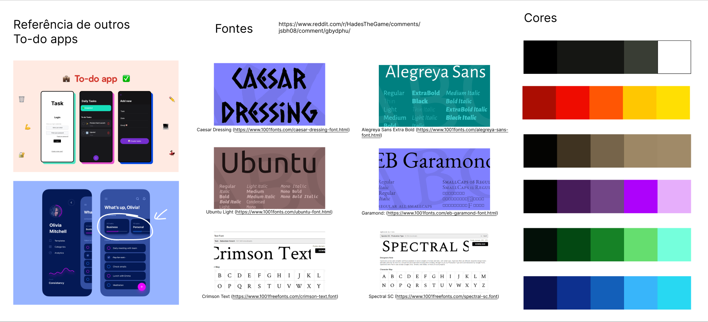
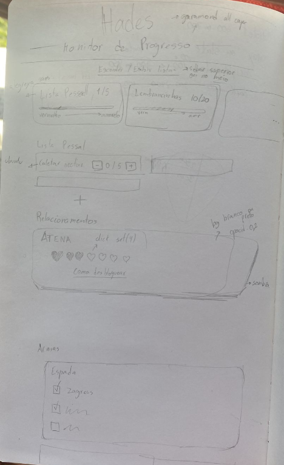

# 🔥 Hades-progress-tracker 🔥

  

 **React**  

Single-page app visando monitar o que fazer em seguida e o que ainda precisa ser feito para completar o jogo Hades.  
Feito pois desejo monitorar melhor meu proprio progresso e gostaria de uma experiencia visualmente mais organizada e também compartilhar com quem gostar da ideia.  

### Moodboard

### Sketch 

